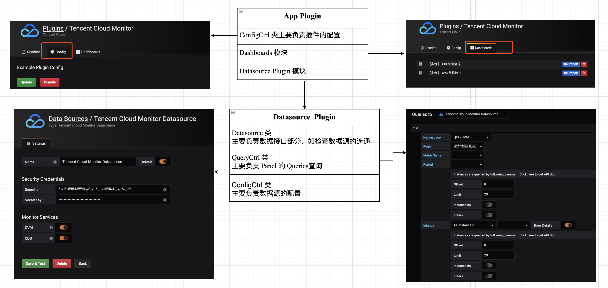
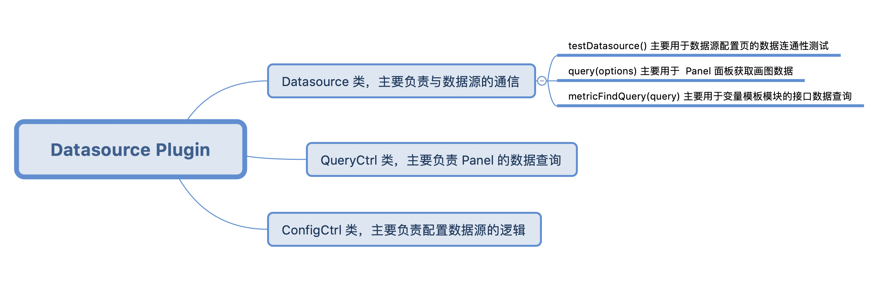
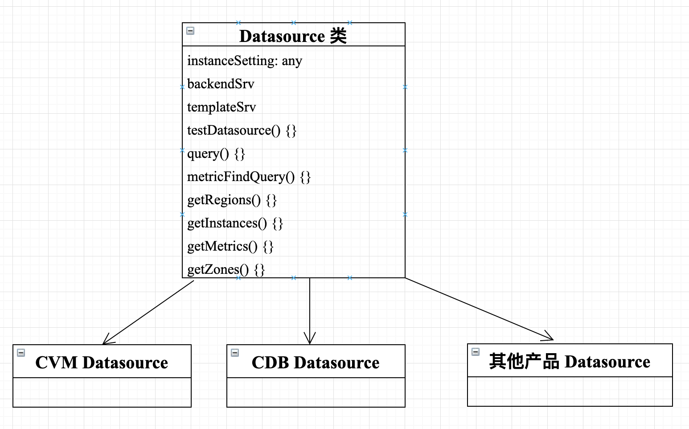
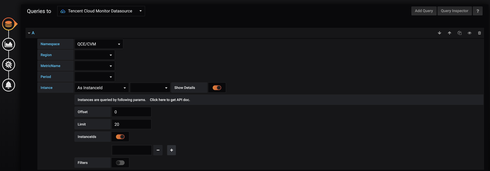
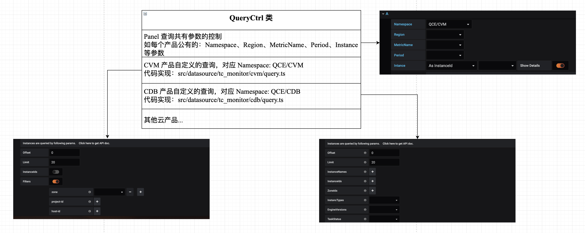
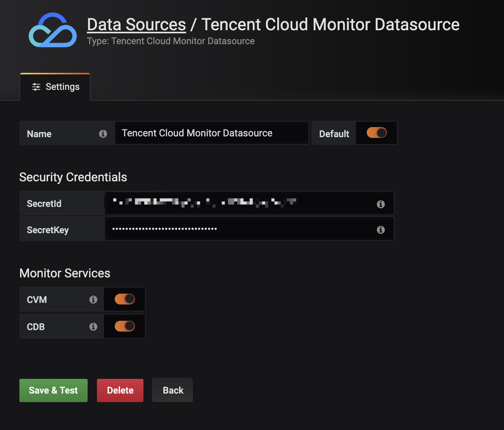

# Tencent Cloud Monitor App 
Grafana 是一个开源的时序性统计和监控平台，支持例如 elasticsearch、graphite、influxdb 等众多的数据源，并以功能强大的界面编辑器著称，允许您对指标进行查询、可视化展示、设置告警等操作，以及自定义配置仪表盘。 

Grafana 已经拥有一个强大的贡献者和插件开发者社区。开发者社区提供了三种类型的插件： 
- Panel Plugin: 针对图形展示的面板插件；
- Datasource Plugin: 针对数据源的插件；
- App Plugin: 针对完整应用的插件，通常由 Panel Plugin，Datasource Plugin 以及 Dashboards 模板组成；

## Tencent Cloud Monitor App 的目录结构
本文主要介绍的是 App Plugin 的开发过程以及相关的代码组织。基于腾讯云云监控 API 的 Tencent Cloud Monitor App 插件([TencentCloud/tencentcloud-monitor-grafana-app](https://github.com/TencentCloud/tencentcloud-monitor-grafana-app))，主要由两部分组成： Datasource Plugin 和 Dashboards 模板组成，代码的目录结构如下：

```
.
├── CHANGELOG.md
├── LICENSE
├── README.md
├── dist                                        // 文件夹，文件夹 src 打包后的代码
├── package.json
├── src
│   ├── components
│   │   ├── config.html
│   │   └── config.ts
│   ├── dashboards                              // Dashboards 典型模板存放
│   │   ├── example_cdb_dashboard.json
│   │   └── example_cvm_dashboard.json
│   ├── datasource                              // Datasource Plguin 代码
│   │   ├── __mocks__
│   │   │   └── core_module.ts
│   │   ├── common
│   │   │   ├── constants.ts
│   │   │   └── sign.ts
│   │   ├── components                          // 自定义的 Angular 组件
│   │   │   ├── custom_select_dropdown.ts
│   │   │   └── multi_condition.ts
│   │   ├── css
│   │   │   └── query_editor.css
│   │   ├── config.ctrl.ts                       // ConfigCtrl 模块
│   │   ├── datasource.ts                        // Datasource 模块
│   │   ├── query.ctrl.ts                        // QueryCtrl 模块
│   │   ├── img
│   │   │   └── tencent-cloud.svg
│   │   ├── partials                             // Datasource Plugin 中的 html 页面
│   │   │   ├── config.html                      // config.ctrl.ts 对应的 html
│   │   │   ├── query.editor.html                // query.ctrl.ts 对应的 html
│   │   ├── module.ts                            // Datasource Plguin 的 module.ts
│   │   ├── plugin.json                          // Datasource Plguin 的 module.ts
│   │   ├── specs                                // 测试用例文件夹
│   │   │   ├── tc_monitor_cdb_datasource.test.ts
│   │   │   └── tc_monitor_cvm_datasource.test.ts
│   │   └── tc_monitor                           // 云监控相关的产品
│   │       ├── cdb
│   │       │   ├── datasource.ts
│   │       │   ├── query.ts
│   │       │   └── query_def.ts
│   │       ├── cvm
│   │       │   ├── datasource.ts
│   │       │   ├── query.ts
│   │       │   └── query_def.ts
│   │       └── index.ts
│   ├── image                                    // 文件夹，存放README.md 中图片
│   ├── img
│   │   └── tencent-cloud.svg
│   ├── module.ts                                // App Plguin 的 module.ts
│   └── plugin.json                              // App Plugin 的 plugion.json
├── jest.config.js                               // jest 框架的配置信息
├── tsconfig.jest.json
├── tsconfig.json
├── tslint.json
├── webpack.config.analyze.js
├── webpack.config.js
└── webpack.config.prod.js
```
在每个 Plugin 开发中存在两个重要的配置文件： **plugin.json** 和 **module.ts**。

### plugin.json
 `plugin.json(Required)`: 用于描述插件的相关信息。在 Grafana 服务启动时会扫描所有的插件文件夹并挂载每个插件的 dist 目录，并查找 `plugin.json` 文件，根据文件的内容完成插件的自动注册。  

在 Tencent Cloud Monitor App 中存在两种类型的 Plugin, 其配置文件如下：
App Plugin 中配置 `plugion.json`：

```json 
{
  "type": "app",                                          // 插件的类型： panel | app | datasource
  "name": "Tencent Cloud Monitor",                        // 插件名称
  "id": "tencentcloud-monitor-app",                       // 插件ID, 必须唯一
  "info": {
    "description": "Tencent Cloud Monitor App for Grafana",
    "author": {
      "name": "Tencent Cloud"
    },
    "keywords": [
      "tencentcloud",
      "tencentcloudmonitor",
      "grafana",
      "plugins"
    ],
    "logos": {
      "small": "img/tencent-cloud.svg",
      "large": "img/tencent-cloud.svg"
    },
    "version": "1.0.0",
    "updated": "2019-04-10"
  },
  "includes": [                                            // App Plugin 中包含的 Datasource Plugin 和 Dashboards 模板信息
    {
      "type": "dashboard",
      "name": "【实例】CDB 单机监控",
      "path": "dashboards/example_cdb_dashboard.json"
    },
    {
      "type": "dashboard",
      "name": "【实例】CVM 单机监控",
      "path": "dashboards/example_cvm_dashboard.json"
    },
    {
      "type": "datasource",
      "name": "Tencent Cloud Monitor Datasource"
    }
  ],
  "dependencies": {
    "grafanaVersion": "6.0",
    "plugins": []
  }
}
```

Datasource Plugin 中配置 `plugin.json`：

```json 
{
  "type": "datasource",
  "name": "Tencent Cloud Monitor Datasource",
  "id": "tencentcloud-monitor-datasource",
  "metrics": true,                           // Datasource plugin 特有的属性，是否在 panel 中支持 metrics
  "annotations": true,                       // Datasource plugin 特有的属性，是否在 dashboard 中支持 annotations 查询
  "queryOptions": {
    "maxDataPoints": true
  },
  "routes": [],
  "info": {
    "author": {
      "name": "Tencent Cloud"
    },
    "logos": {
      "small": "img/tencent-cloud.svg",
      "large": "img/tencent-cloud.svg"
    }
  }
}
```

**特别注意** Datasource Plugin 的 `plugin.json` 配置中必须存在 **metric** 和 **annotations**，且其中至少有一个属性的值为 `true`。

### module.ts
`module.ts(Required)`： Plugin 入口文件，决定了 Plugin 的具体实现的。根据插件的类型不同其内容也有所差异。 

```javascript 
/* App Plugin 的 module.ts 需要导出1个模块 */
export {
  ConfigCtrl,
};

/* Datasource Plugin 的 module.ts 通常需要导出5个模块 */
export {
  Datasource,                 // Required
  ConfigCtrl,                 // Required
  QueryCtrl,                  // Required
  AnnotationsQueryCtrl,
  QueryOptionsCtrl
};
```

## Tencent Cloud Monitor App 开发实践
基于腾讯云云监控 API —— Tencent Cloud Monitor App 完整结构图如下所示：  
  

在整个应用开发中最为重要的是 Datasource Plugin 模块的开发，下面我们以该模块为例进行详细介绍。

### Datasource Plugin 的开发 
Datasource Plugin 中有3个必须文件：`Datasource`、 `QueryCtrl` 和 `ConfigCtrl`；  


### Datasource 
Datasource 类作为数据入口，主要负责与数据源进行通信。
针对 Tencent Cloud Monitor App 中不同的产品，都必须有一个对应 Datasource 实现类。因此我们定义了一个 Datasource 类的接口协议，每个产品的 Datasource 类都必须遵循这个接口协议：  
```javascript 
interface DatasourceInterface {
  instanceSettings: any;
  backendSrv: any;
  templateSrv: any;
  query(options: any);
  testDatasource();
  metricFindQuery(query: any);
  getRegions(service: string);
  getMetrics(service: string, region: string);
  getInstances(service: string, region: string, params: any);
  getZones?: (service: string, region: string) => any;
}
```
备注：  

```javascript 
// Datasource 类如果要实现以下功能函数，则必须遵循 Grafana 命名协议约定，所以 Datasource 类的接口协议也是按照该要求进行设计。
query(options)             // Required, used by panels to get data
testDatasource()           // Required, used by datasource configuration page to make sure the connection is working
annotationQuery(options)   // used by dashboards to get annotations
metricFindQuery(options)   // used by query editor to get metric suggestions.
```

Datasource 类的主要代码：  
```javascript 
/* Datasource Plugin 中的 datasource 类 */
import { Datasources, SERVICES } from './tc_monitor';   // Datasources 是每个云产品对应的 Datasource 实现类组成的对象
export class TCMonitorDatasource implements DatasourceInterface {
  instanceSettings: any;
  backendSrv: any;
  templateSrv: any;

  /** @ngInject */
  constructor(instanceSettings, backendSrv, templateSrv) {
    this.instanceSettings = instanceSettings;
    this.backendSrv = backendSrv;
    this.templateSrv = templateSrv;
    _.forEach(Datasources, (_class, key) => {                   // 自动实例化每个云产品的 Datasource 类
      this[key] = new _class(this.instanceSettings, this.backendSrv, this.templateSrv);
    });
  }
  testDatasource() {...}                 // 根据选中的云产品去调用每个云产品 Datasource 类中对应的 testDatasource()
  query(options) {...}                   // 根据选中的云产品去调用每个云产品 Datasource 类中对应的 query()
  metricFindQuery(query) {...}           // 根据选中的云产品去调用每个云产品 Datasource 类中对应的 getRegions()
  getRegions() {...}                     // 根据选中的云产品去调用每个云产品 Datasource 类中对应的 getMetrics()
  getMetrics() {...}                     // 根据选中的云产品去调用每个云产品 Datasource 类中对应的 getZones()
  getInstances() {...}
  getZones() {...}
}

/*CVM 产品中的 datasource 模块*/ 
export default class CVMDatasource implements DatasourceInterface {
  constructor() {...}
  testDatasource() {...}
  query(options) {...}
  metricFindQuery(query) {...}
  getRegions() {...}
  getMetrics() {...}
  getInstances() {...}
  getZones() {...}
}
```

在新增产品时只需在 `tc_monitor` 目录中增加对应子目录实现各自的 `datasource.ts` 类（继承`DatasourceInterface` 协议），再在`tc_monitor` 目录的 index.tx 文件中通过 Datasources 配置该类入口。



### QueryCtrl 
当用户在 Dashboard 页面对 Panel 进行编辑时，QueryCtrl 类将被实例化并作为 Angular 控制器，并根据类中的 `templateUrl` 去加载对应的 View 视图，以图形化的界面提供接口数据查询。该类必须继承自 **grafana/app/plugins/sdk**。具体页面展示以及主要代码逻辑如下：

```javascript
import { QueryCtrl } from 'grafana/app/plugins/sdk';

export class TCMonitorDatasourceQueryCtrl extends QueryCtrl {
  static templateUrl = 'datasource/partials/query.editor.html';
  datasource: any;                  // 对应 datasource.ts 实例的对象
  panelCtrl: any;                   // 对应 Panel 的实例对象
  target: {                         // 具体的查询条件信息保存
    refId: string;
    namespace: string;
    service: string;
    showInstanceDetails: boolean;
  };
  defaults = {                      // 初始化值
    namespace: '',
    service: '',
    showInstanceDetails: false,
    ...InitServiceState,
  };

  lastQuery: string;
  lastQueryError?: string;

  /** @ngInject */
  constructor($scope, $injector, private templateSrv) {
    super($scope, $injector);
    _.defaultsDeep(this.target, this.defaults);
    this.panelCtrl.events.on('data-received', this.onDataReceived.bind(this), $scope);
  }

  // Panel 实例的数据接收处理函数
  onDataReceived(dataList) {
    this.lastQueryError = undefined;
    this.lastQuery = '';
    const anySeriesFromQuery: any = _.find(dataList, { refId: this.target.refId });
    if (anySeriesFromQuery) {
      this.lastQuery = anySeriesFromQuery.query;
    }
  }

  // Panel 数据查询失败的调用函数
  onDataError(err) {
    this.handleQueryCtrlError(err);
  }

  handleQueryCtrlError(err) {...}
  // 省略其它详细代码
}
```

对应视图 View 中的部分代码如下，`<query-editor-row query-ctrl="ctrl"></query-editor-row>` 标签的内容会加入到Add Query模板中：
``` html 
<query-editor-row query-ctrl="ctrl" class="generic-datasource-query-row" has-text-edit-mode="true">
  <div class="gf-form-inline">
    <div class="gf-form">
      <label class="gf-form-label query-keyword width-9">Namespace</label>
      <div class="gf-form-select-wrapper gf-form-select-wrapper--caret-indent">
        <select class="gf-form-input min-width-12" ng-model="ctrl.target.namespace" ng-options="f as f for f in ctrl.namespaces"
          ng-change="ctrl.onNamespaceChange()"></select>
      </div>
    </div>
  </div>
  <!-- 省略更多详情 -->

  <!-- 新增不同的云产品，需要在该处增加新产品独有的配置页面 -->
  <!-- CVM -->
  <cvm-query
    ng-if="ctrl.target.service==='cvm'"
    target="ctrl.target.cvm"
    show-detail="ctrl.checkShowDetail('instance')"
    datasource="ctrl.datasource"
    on-change="ctrl.onInstanceQueryChange()"
    region="ctrl.replace(ctrl.target.cvm.region)"
  ></cvm-query>

  <!-- Global error message -->
  <div class="gf-form" ng-show="ctrl.lastQueryError">
    <pre class="gf-form-pre alert alert-error">{{ctrl.lastQueryError}}</pre>
  </div>
</query-editor-row>
```
 QueryCtrl 类是查询面板的入口，其中 `Namespace`、`Region`、`MetricName`、 `Period`、 `Insatnce` 查询条件是腾讯云产品共有的，其业务逻辑实现在 QueryCtrl 类中。对于自定义业务，则可在自定义QueryCtrl 类中实现单独的 Angular 组件。以上面图片显示的面板为例，其中 ShowDetail 控制获取特定业务的实例列表数据，因此需抽象到单独的 Angular 组件中。新增产品则需要在 `tc_monitor` 目录实现各自的 `query.ts` 类，并在 index.tx 文件中通过 `import` 注册该组件，则对应在 `query.editor.html` 中引入产品实现的组件即可。


### ConfigCtrl 类
ConfigCtrl 类是添加数据源的面板进行控制。
当用户对该 App Plugin 的数据源进行配置时，该类会被实例化为 Angular 的控制器，并根据类中的 `templateUrl` 去加载对应的 View 视图，用于呈现数据源自定义配置的面板。具体页面展示示例如下： 
  
```javascript 
/* 文件路径为 /src/datasource/config.ctrl.ts */
import * as _ from 'lodash';
import { SERVICES } from './tc_monitor';

export class TCMonitorDatasourceConfigCtrl {
  static templateUrl = 'datasource/partials/config.html';   // 指定该Controller 对应 View 文件，且实际路径为 /src/datasource/partials/config.html
  current: any;
  /** @ngInject */
  constructor($scope) {
    this.current.jsonData.services = SERVICES;
    _.forEach(this.current.jsonData.services, (service) => {
      this.current.jsonData[service.service] = true;
    });
  }
}
```

## 结束
Tencent Cloud Monitor App 已经在 github.com 上开源了，欢迎大家多提 issues，顺便给我们 Star 鼓励一下。  
项目地址：TencentCloud/tencentcloud-monitor-grafana-app (https://github.com/TencentCloud/tencentcloud-monitor-grafana-app)  

项目代码开发成员：
- susiezhao(https://github.com/susiezhao)
- taoran34(https://github.com/taoran34)


