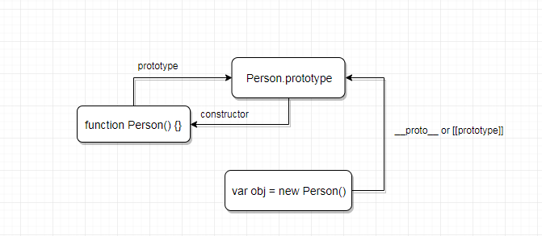
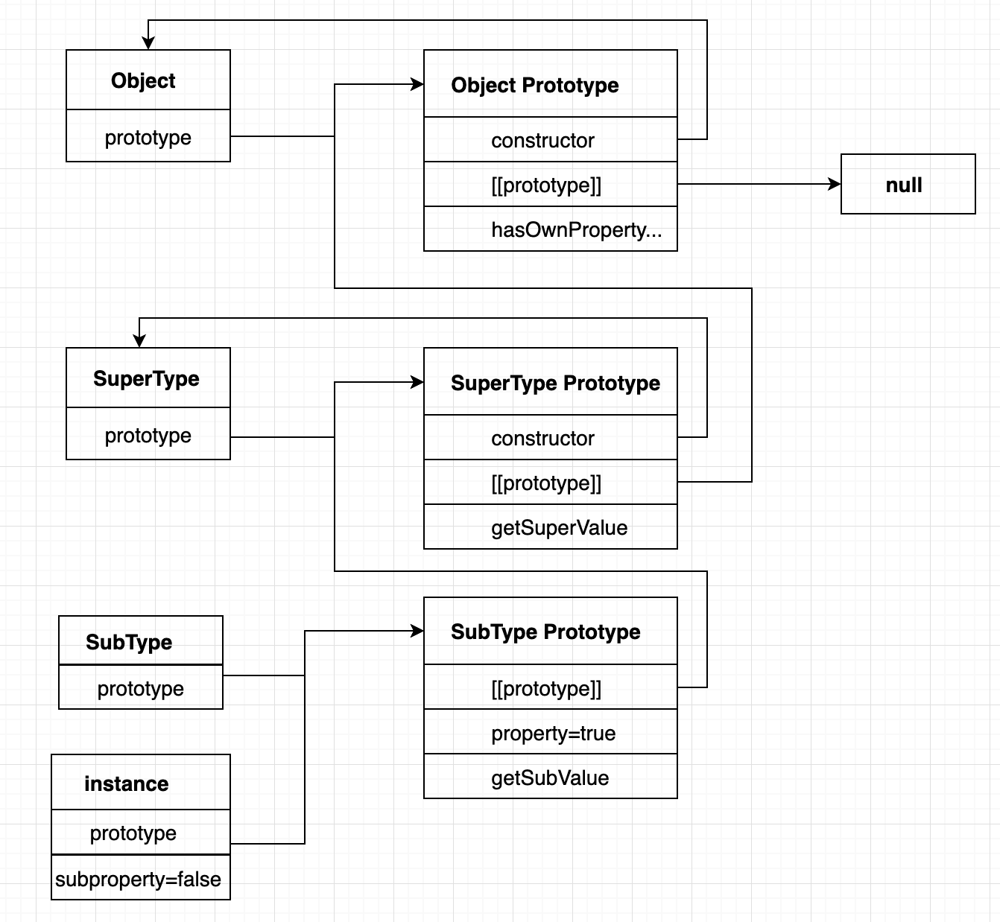

## 原型与原型链
JavaScript 也是一种面向对象的语言，在 JavaScript 中一切皆为对象。 JavaScript 采用的是基于原型的面向对象系统，且通过基于原型链的方式来实现继承的。

### 构造函数、原型对象及实例的关系
在 JavaScript 中所有的函数都有一个不可枚举的 `prototype` 的属性，该属性是一个指针，指向一个被称为原型的对象（即原型）。原型对象有一个默认不可枚举的 `constructor` 属性，其也是一个指针，默认指向与原型对象关联的函数。例如：  `function Foo() {}` 的原型对象是 `Foo.prototype`，则有 `Foo.proptotype.constructor === Foo ` 成立。  

在 JavaScript 中通过关键字 `new` 调用的函数通常被称为构造函数。在默认的约定中，构造函数的首字母始终为大写字母，非构造函数的首字母则以一个小写字母开头。构造函数通常是用来创建特定类型的对象，且通过构造函数生成的对象称为该构造函数的实例。
构造函数又分为原生构造函数，如 `Array`、 `String`、 `RegExp` 等，还可以自定义构造函数。通常采用 `instanceof` 来检测对象的类型。即对象的 `constructor` 属性。 对象上的 `constructor` 属性本质上是获取的对应原型对象上的 `constructor` 属性。  
构造函数必须使用 `new` 操作符调用，且调用的过程中经历了下面4个阶段：
- 创建了一个新对象；
- 将构造函数的作用域赋值给创建的新对象（`this` 指向上面步骤中的新对象）
- 执行构造函数的代码，即为新对象添加属性等
- 返回这个新对象

```javascript 
function Person(name, age, sex) {
  this.name = name;
  this.age = ange;
  this.sex = sex;
}
var person1 = new Person('susie', 18, 'female');
```

在 JavaScript 中一切皆为对象，且所有对象都存在一个内置属性 `[[prototype]]`, 通常可以通过 `Object.getPrototypeOf(obj)` 获取。 在 Firefox, Safari 和 Chrome 浏览器中该内置属性可以通过 `__proto__` 获取。该属性是一个指针，指向构造该对象i的构造函数的原型对象。即 `[[prototype]]` 这个链接是存在于实例对象和对应的原型对象之间，而不是存在实例对象和对应的构造函数之间。实例对象，构造函数和原型对象之间的关系是：
  

### 原型与实例的关系
获取原型与实例的关系主要有两个方法：
- `instanceof`: 只要在该实例的原型中出现的构造函数，结果都会返回 `true`;
- `isPrototypeOf()`: 只要是该原型链上出现过的原型对象，结果都会返回 `true`。

实例设置与获取原型对象的的方法：
- `Object.create()`: ES6 之前采用的方法， `Bar.prototype = Object.create(Foo.prototype)`
- `Object.setPrototypeOf()`: ES6 提供的新的方法， `Object.setPrototypeOf(Bar.prototype, Foo.prototype)`
- `Object.getPrototypeOf()`: 获取一个对象的原型对象

`Object.create` 调用方式: `Object.create(proto, [propertiesObject])`:
- `proto`: 新创建对象的原型对象。
- `propertiesObject`: 可选。如果没有指定为 `undefined`，则是要添加到新创建对象的可枚举属性（即其自身定义的属性，而不是其原型链上的枚举属性）对象的属性描述符以及相应的属性名称。

## 原型链
在 JavaScript 中一切皆被称为对象。每个对象内都存在一个 `[[prototype]]` 的内部链接指向该实例的原型对象。当在一个对象上查找一个属性或者方法时，如果找到就直接放回，否则引擎就会在对象的 `[[prototype]]` 所指向的原型对象上继续查找，过程以此类推。在整个过程中这一系列的对象的链接构成了原型链。  
原型链是 JavaScript 实现类继承的主要依据。在其他语言中继承通常意味着复制操作，但是在 JavaScript 中的继承是有原型链实现的，其本质是在两个对象之间建立起一个关联，这样一个对象就可以通过原型链查找方法访问到与之关联对象的属性和方法。  
**注意：** 基于原型链实现的继承是动态的继承，即对原型对象的任何修改都能立刻在对应的实例上反映出来。
```javascript 
function SuperType() {
  this.property = true;
}
SuperType.prototype.getSuperValue = function() {
  return this.property;
}

function SubType() {
  this.subproperty = false;
}
SubType.prototype = new SuperType();
SubType.prototype.getSubValue = function() {
  return this.subprototype;
};
var instance = new SubType();
alert(instance.getSuperValue());  // true
alert(instance instanceof SubType);   // true
alert(instance instanceof SuperType);  // true
alert(instance instanceof Object);     // true
alert(Object.prototype.isPrototypeOf(instance));  // true 
alert(SuperType.prototype.isPrototypeOf(instance));  // true
alert(SubType.prototype.isPrototypeOf(instance));    // true
```
完整的原型链如下所示:   
**注意：**所有对象都默认是 `Object` 的实例。

## ES6 之前的类
在 ES6 之前，JavaScript 采用构造函数以及原型的机制来模拟类的实现。如：
```javascript 
function Person(name, age, sex) {
  this.name = name;
  this.age = ange;
  this.sex = sex;
}
Person.prototype.sayName = function() {
  console.log(this.name);
};
var person1 = new Person('susie', 18, 'female');
```

## ES6 中的类
ES6 提供了 `class` 关键字以及相关机制来事项面向对象。`class` 开头定义的一个类块代码完全与 ES6之前构造函数定义的内容是等价的, ES6 之前的构造函数 `Person` 是等价于 ES6 `class Person` 中的 `constructor` 函数，同时 `class Person` 中 定义的 `sayName` 方法等价于 ES6 之前构造函数的原型上的方法 `Person,prototype.sayName`。
```javaScript 
class Person {
  constructor(name, age, sex) {
    this.name = name;
    this.age = age;
    this.sex = sex;
  }
  sayName() {
    console.log(this.name);
  }
}
var person = new Person('susie', 19, 'female');
Person.constructor === Person.prototype.constructor; // true
typeof Person; // function
```
**注意：** 
- `class` 定义体内部不准使用逗号分隔成员。
- 定义的类方法时不需要加上 `function` 关键字，且类方法都是不可枚举的。
- `class` 定义的类生成对象必须通过 `new` 来实现。此时会自动调用类的 `constructor` 方法。
- 一个类必须有 `constructor` 方法，如果没有显式定义，一个空的 `constructor` 方法会被默认添加。
- `class` 的 `constructor` 方法中定义的属性是直接存在该类所对应的实例对象上的，此外实例属性还可以在类的最顶层定义；而类内部定义的其他方法都是定义在原型对象上的，被该类所对应的所有实例对象所共享的。

```javascript 
class Person {
  address = 'nan shan';   // 最顶层定义的实例属性
  constructor(name) {
    this.name = name;
  }
}
```
- `class` 也可以作为一个表达式， `var a = class Person {}`。
- `class` 不存在变量提升，必须先定义在调用。

### 类的继承
相比于 ES6 之前通过修改原型链来实现继承，ES6 提供了 `extends` 关键字来实现继承。ES6 规定采用 `extends` 实现继承时，子类必须在构造函数中调用 `super()` 方法，否则子类创建实例时会报错。
```javascript 
// ES6 之前的继承
function Foo(a, b) {
  this.a = a;
  this.b = b;
}
function Bar(a, b, c) {
  this.c = c;
  Foo.call(this, a, b);
}
Bar.prototype = Object.create(Foo.prototype);

// ES6 实现继承
class Foo {
  constructor(a, b) {
    this.a = a;
    this.b = b;
  }
}
class Bar extends Foo {
  constructor(a, b, c) {
    super(a, b);   // 必须先写，等价于 Foo.prototype.constructor.call(this, a, b)
    this.c = c;
  }
}
```
ES6 之前的继承实质上是先创造子类的实例对象 `this`, 然后再将父类对象的属性和方法添加到 `this` 上；而 ES6 继承的实质则是先创造父类的实例对象 `this`（优先调用 `super()` 方法），然后再用子类的构造函数修改 `this`。

`super` 关键字一般和 `extends` 一起出现在类的继承中，调用其时，必须显示指定 `super` 是作为函数使用还是作为对象使用，否则会报错：
- `super()`: 作为函数使用时，其表示父类的构造函数。且只能在子类的构造函数中使用。
- `super.xxx`: 作为对象使用时，在子类的普通方法中指向父类的原型对象；在子类的静态方法中指向父类本身。ES6 规定，在子类的普通方法中通过 `super` 对象调用父类的方法时，方法内部的 `this` 指向当前子类的实例对象；在子类的静态方法中通过 `super` 对象调用父类的方法时，方法内的 `this` 指向当前子类本身。

```javascript 
class Parent {
  static myMethod(msg) {
    console.log('static:', msg);
  } 
  myMethod(msg) {
    console.log('instance:', msg);
  }
}
class Child extends Parent{
  static myMethod(msg) {
    super.method(msg);
  }
  myMethod(msg) {
    super.myMethod(msg);
  }
}
Child.myMethod(1);  // static: 1
var child = new Child();
child.myMethod(1);  // instance: 1
```

### 类中的 new.target 属性
ES6 为所有函数引入了一个新的 `new.target` 的属性，在一般函数中其值通常为 `undefined`; 在任何构造器中，`new.target` 指向 `new` 实际上直接调用的构造器函数。因此如果 `new.target` 是 `undefined`，则可以知道这个函数不是通过 `new ` 调用的。
```javascript 
class Foo {
  constructor() {
    console.log('Foo: ', new.target.name);
  }
}
class Bar extends Foo{
  constructor() {
    super();
    console.log('Bar: ', new.target.name);
  }
  bar() {
    console.log('bar: ', new.target)
  }
}
var a = new Foo();  // Foo: Foo
var b = new Bar(); 
// Foo: Bar
// Bar: Bar

b.bar(); // bar: undefined
```

### 类的静态方法
类相当于实例的原型，所有在类中定义的方法，都会被实例继承。如果在一个方法前，加上 `static` 关键字，就表示该方法是不会被实例继承，而是直接通过类来调。如果静态方法包含`this` 关键字，这个 `this` 指的是类，而不是实例。且父类的静态方法可以被子类继承。
```javascript 
class Foo {
  static bar() {
    this.baz();
  }
  static baz() {
    console.log('hello');
  }
  baz() {
    console.log('world');
  }
}

Foo.bar() // hello
var foo = new Foo();
foo.bar();  // Uncaught TypeError: foo.bar is not a function
```

### 类的 prototype 属性和 [[prototype]] 属性
`class` 定义的函数同时存在 `prototype` 和 `[[prototype]]` 两个属性。
- 子类的 `[[prototype]]` 表示构造函数的继承，总是指向父类；
- 子类 `prototype` 属性的 `[[prototype]]` 表示方法的继承，总是指向父类的 `prototype` 的属性。

```javascript 
class A {}
class B extends A {}
B.__proto__ === A; // true
B.prototype.__proto === A.prototype; // true

// 等价于
class A {}
class B {}
// B 的实例继承 A 的实例
Object.setPrototypeOf(B.prototype, A.prototype);
// B 继承 A 的静态属性
Object.setPrototypeOf(B, A);

Object.setPrototypeOf = function(obj, proto) {
  obj.__proto = proto;
  return obj;
}

```